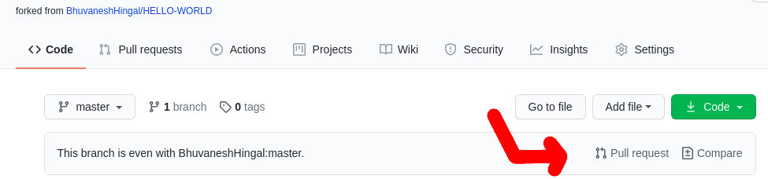

***A repository for contributing a "HELLO WORLD" program in any of the programming languages you know.***

## How to Contribute: 👨🏻‍💻

1. Fork the project.
2. Make any changes in your forked repo
3. On this repo, click `Pull Requests` and raise a `Pull Request` selecting your fork on the right drop down

Questions can be asked by raising an `Issue`.

## How to clone repo and make changes locally: ✂📋


  Click on the clone button (green in colour). This gives you a copy of the project. Its now yours to play around with

- Using git on your local machine. Do this to clone the forked copy of this repo to your computer

```sh
  git clone https://github.com/<Your Github Username>/HELLO-WORLD.git

  cd HELLO-WORLD
```

- Make a new branch. Your name would make a good branch because it's unique

```
  git checkout -b <your username or something else if you want>
```

- Open the Contributors folder and create a folder with your username as its name. Add all the files of the **HELLO WORLD** program inside the folder of your name.

- Stage your changes
  ```sh
    git add .
  ```

- Commit the changes

```sh
  git commit -m "A commit message like `Added hello world in some language`"
```

- Pushing your repository to github

```sh
  git push origin <name of your branch>
```

- Making your pull request.
  - ***Note : A pull request allows your changes to be merged with the original project.***

  

  Click on Pull Request

- Wait for your changes to be merged

- Voila! You successfully made a contribution. 😉
